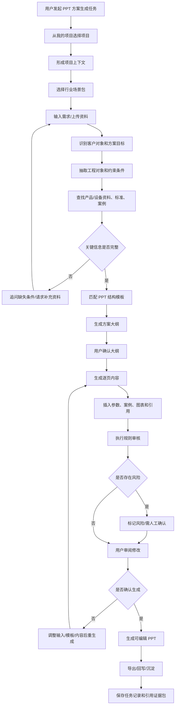
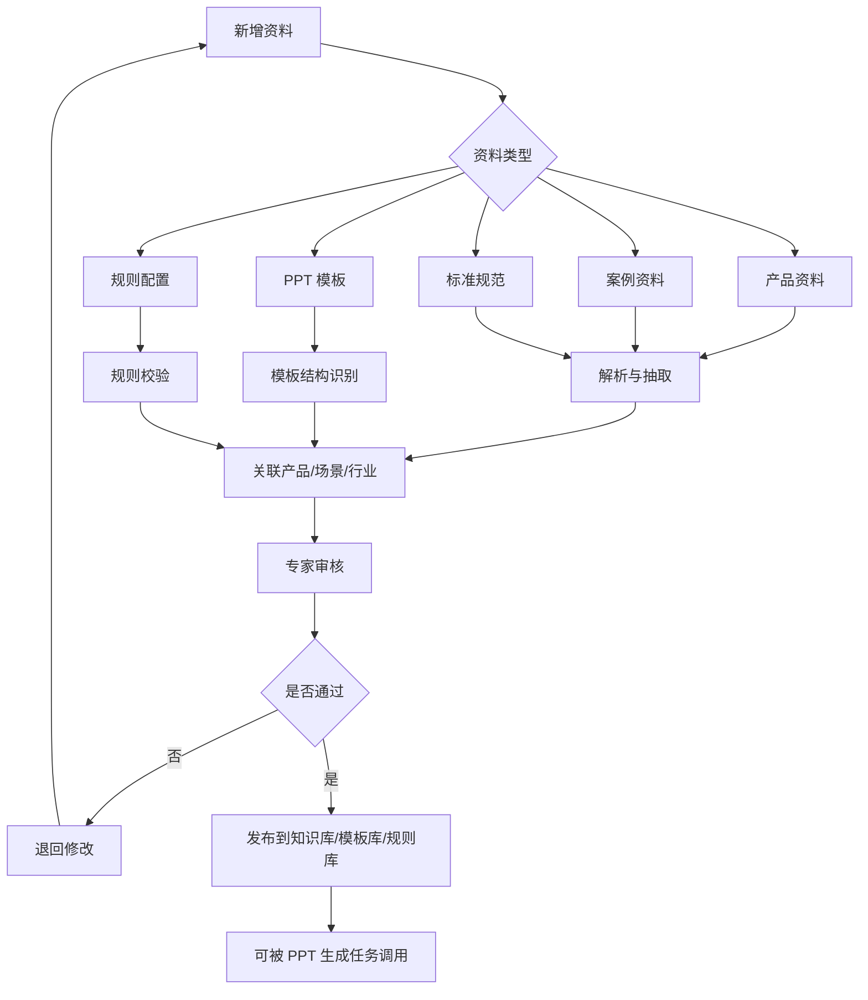

# 定制方案生成（PPT）Agent 详细流程

本文档以“定制方案生成 PPT”为例，拆解工程文档 Agent 在生成类任务中的输入、输出、数据、知识库、规则、模板和详细流程。

## 1. 场景定义

定制方案生成 PPT 是指：用户输入客户需求、项目场景、产品/设备资料、行业约束和输出对象，Agent 自动查找依据、组织方案逻辑、生成 PPT 大纲和页面内容，并输出可编辑、可追溯、可审阅的方案演示文稿。

该场景不是通用 PPT 生成。它的重点是：

- 基于真实产品/设备资料生成内容。
- 根据行业场景定制方案结构。
- 针对不同客户对象调整表达方式。
- 引用 TDS、SDS、说明书、检测报告、认证、案例、标准规范等依据。
- 标记缺失信息、参数风险和需人工确认项。

适用行业：

- 涂料
- 装备制造
- 电力设备
- 化工设备
- 水处理设备
- 能源设备
- 矿山设备
- 建筑材料

## 2. 典型用户

| 用户 | 典型目标 |
| --- | --- |
| 技术销售 | 为客户快速生成项目解决方案 PPT |
| 解决方案工程师 | 把技术路线、产品组合和案例组织成方案 |
| 产品经理 | 生成面向行业客户的产品推广方案 |
| 应用工程师 | 根据工况和施工条件生成应用方案 |
| 售前负责人 | 统一方案结构、风格和技术口径 |

## 3. 输入细节

### 3.1 用户自然语言输入

示例：

- “给沿海钢结构厂房生成一份防腐涂装方案 PPT，客户是业主方，重点讲耐久性和施工可控。”
- “为矿山破碎站除尘系统改造生成一个技术方案 PPT，突出降尘效果、设备可靠性和改造周期。”
- “基于我们 A 系列水处理设备，给化工园区循环水项目生成一份解决方案。”
- “生成一份面向设计院的电力设备技术推荐 PPT，重点讲标准符合性和项目案例。”

需要解析的字段：

| 字段 | 示例 |
| --- | --- |
| 行业 | 涂料、装备制造、电力设备、化工设备 |
| 项目类型 | 沿海钢结构厂房、矿山破碎站、化工园区循环水 |
| 客户对象 | 业主、设计院、总包、施工单位、经销商 |
| 工程对象 | 钢结构、除尘系统、水处理设备、电力设备 |
| 使用环境 | C5-M、粉尘、高湿、化工腐蚀、高温 |
| 方案目标 | 耐久性、可靠性、节能、降本、合规、快速施工 |
| 输出要求 | 页数、语言、风格、模板、是否含案例 |
| 约束条件 | 预算、工期、标准、产品范围、竞品替代 |

### 3.2 结构化输入

| 输入项 | 是否必填 | 说明 |
| --- | --- | --- |
| 我的项目 | 建议必填 | 选择当前项目入口 |
| 项目上下文 | 自动形成 | 限定资料范围、输出归属和权限约束 |
| 行业场景包 | 必填 | 决定术语、模板、规则和方案结构 |
| 客户对象 | 必填 | 决定表达角度和重点 |
| 项目/应用场景 | 必填 | 决定方案逻辑 |
| 产品/设备范围 | 条件必填 | 指定可用产品或设备 |
| 技术要求 | 可选 | 用于方案匹配和风险提示 |
| 标准规范 | 可选 | 用于合规依据 |
| 历史案例 | 可选 | 用于案例页和背书 |
| 输出模板 | 可选 | 企业 PPT 模板或行业模板 |
| 页数范围 | 可选 | 例如 8 页、12 页、20 页 |
| 输出语言 | 可选 | 中文、英文、中英双语 |

### 3.3 文件输入

用户可上传或引用：

- 客户需求说明。
- 项目背景资料。
- 技术规格书。
- 产品 TDS/SDS。
- 设备说明书。
- 检测报告。
- 认证证书。
- 产品手册。
- 历史方案 PPT。
- 历史项目案例。
- 企业 PPT 模板。
- 品牌规范。

系统需要识别：

- 文件类型。
- 适用产品/设备。
- 关键技术参数。
- 认证和检测结论。
- 项目案例信息。
- 可复用页面结构。
- 品牌模板和版式规则。
- 文件版本和有效性。

## 4. 所需数据

### 4.1 项目与客户数据

| 数据项 | 示例 |
| --- | --- |
| 项目名称 | 某沿海钢结构厂房防腐项目 |
| 行业 | 涂料 |
| 工程对象 | 钢结构厂房 |
| 使用环境 | 沿海、C5-M、高湿、紫外 |
| 客户对象 | 业主方 |
| 客户关注点 | 使用寿命、施工周期、维护成本、质保 |
| 项目阶段 | 技术交流、方案推荐、深化设计、交付准备 |
| 输出目的 | 技术交流、客户汇报、方案评审、内部评审 |

### 4.2 产品/设备数据

| 数据项 | 示例 |
| --- | --- |
| 产品/设备 ID | PROD-A-102 |
| 名称 | A-102 环氧底漆 |
| 类别 | 底漆、设备、系统、材料 |
| 适用场景 | 钢结构、混凝土、化工腐蚀、矿山粉尘 |
| 关键参数 | VOC、固含、膜厚、功率、处理量、效率 |
| 推荐组合 | 底漆+中间漆+面漆，主机+过滤单元+控制系统 |
| 认证/检测 | 耐盐雾、VOC、能效、行业认证 |
| 状态 | 在售、停用、替代、受限 |
| 替代关系 | A-102 可替代旧型号 A-101 |

### 4.3 方案知识数据

| 数据项 | 示例 |
| --- | --- |
| 方案类型 | 防腐涂装方案、除尘改造方案、水处理方案 |
| 标准章节结构 | 背景、痛点、方案、产品、施工、案例、收益 |
| 典型技术路线 | 表面处理+涂层体系+质量控制 |
| 常见客户关注点 | 成本、寿命、可靠性、合规、交付周期 |
| 风险提示 | 低温施工、高湿、停机窗口不足、资料缺失 |
| 可复用案例 | 同类项目、同类工况、同类客户 |

### 4.4 案例数据

| 数据项 | 示例 |
| --- | --- |
| 案例名称 | 某沿海钢结构项目 |
| 行业 | 工业厂房 |
| 工况 | C5-M、海洋大气 |
| 使用产品 | A-102、M-305、F-680 |
| 项目规模 | 20 万平方米钢结构表面 |
| 结果 | 使用 5 年后维护良好 |
| 可公开级别 | 内部、客户可见、公开 |
| 图片/图表 | 现场图、施工图、对比图 |

### 4.5 品牌与模板数据

| 数据项 | 示例 |
| --- | --- |
| PPT 模板 | 企业标准模板、行业方案模板 |
| 色彩规范 | 品牌蓝、辅助灰、风险橙 |
| 字体规范 | 标题、正文、注释 |
| Logo 规范 | 首页、页脚、封底 |
| 页面类型 | 封面、目录、问题页、方案页、产品页、案例页、结尾页 |
| 禁用表达 | 绝对化承诺、无依据质保、未经批准参数 |

## 5. 知识库设计

### 5.1 知识库分层

```text
方案生成知识库
├── 产品/设备资料库
├── 产品参数库
├── TDS/SDS/说明书库
├── 检测报告与认证库
├── 标准规范库
├── 行业方案模板库
├── 企业 PPT 模板库
├── 历史方案库
├── 项目案例库
├── 客户画像与表达策略库
├── 图表/图片素材库
└── 禁用表达与风险规则库
```

### 5.2 检索方式

| 检索方式 | 用途 |
| --- | --- |
| 产品/设备精确检索 | 找到指定产品或设备资料 |
| 场景语义检索 | 查找相似工况、相似行业方案 |
| 参数检索 | 查找膜厚、VOC、效率、处理量等参数 |
| 案例检索 | 找同类客户、同类项目、同类环境案例 |
| 模板检索 | 匹配行业 PPT 模板和页面结构 |
| 规则检索 | 检查禁用表达、参数风险、认证范围 |
| 权限过滤 | 过滤不可用于客户外发的资料和案例 |

### 5.3 索引字段

每份资料建议建立以下索引：

- 行业。
- 应用场景。
- 客户对象。
- 产品/设备型号。
- 关键参数。
- 适用环境。
- 标准编号。
- 案例类型。
- 文件类型。
- 文件版本。
- 可公开级别。
- 来源系统。
- 原文页码。
- 权限标签。

## 6. 模板设计

### 6.1 PPT 结构模板

基础方案模板：

| 页码 | 页面类型 | 页面目标 | 内容来源 |
| --- | --- | --- | --- |
| 1 | 封面 | 明确客户、项目、方案主题 | 用户输入、项目上下文 |
| 2 | 目录 | 展示方案结构 | 模板 |
| 3 | 项目背景 | 说明项目场景和客户需求 | 客户资料、用户输入 |
| 4 | 痛点与挑战 | 提炼工程痛点 | 行业场景包、历史案例 |
| 5 | 方案总览 | 给出整体技术路线 | 产品资料、标准、案例 |
| 6 | 产品/设备组合 | 说明推荐组合和选择理由 | 产品/设备资料库 |
| 7 | 关键参数与依据 | 展示参数、认证、检测结论 | TDS、说明书、检测报告 |
| 8 | 实施/施工/部署流程 | 说明落地步骤 | 工艺文件、作业指导书 |
| 9 | 质量控制与风险 | 展示控制点和风险措施 | 标准、规则库 |
| 10 | 项目案例 | 提供同类案例背书 | 案例库 |
| 11 | 价值收益 | 总结寿命、效率、成本、合规收益 | 计算结果、案例 |
| 12 | 后续计划 | 给出下一步动作 | 用户输入、模板 |

### 6.2 按客户对象调整模板

| 客户对象 | 强调内容 | 弱化内容 |
| --- | --- | --- |
| 业主 | 投资收益、寿命、风险、维护成本、案例 | 过细施工细节 |
| 设计院 | 标准符合性、参数、规范依据、技术路线 | 销售话术 |
| 总包 | 交付周期、施工组织、质量控制、接口 | 品牌宣传 |
| 施工单位 | 工艺步骤、材料用量、施工条件、验收 | 战略价值 |
| 经销商 | 产品卖点、应用场景、竞品替代、话术 | 深度工程计算 |

### 6.3 页面组件模板

| 组件 | 用途 |
| --- | --- |
| 标题 + 摘要 | 每页核心结论 |
| 参数表 | 展示产品/设备关键参数 |
| 方案流程图 | 展示实施路径 |
| 产品组合卡片 | 展示推荐组合 |
| 案例卡片 | 展示历史项目 |
| 风险提示框 | 标记注意事项 |
| 引用脚注 | 标记来源文件 |
| 对比表 | 展示方案或产品差异 |

## 7. 规则设计

### 7.1 内容规则

- 不允许编造产品参数、认证、检测结论和案例。
- 产品参数必须来自结构化产品库或可信资料文件。
- 认证、检测和标准符合性必须附带来源。
- 适用性结论必须区分“明确支持”“资料不足”“不建议使用”。
- 涉及质保、寿命、性能承诺时必须有依据。
- 停用、替代或受限产品不得默认推荐。
- 不得使用未经授权的客户案例。

### 7.2 PPT 结构规则

- 首页必须包含项目名称、客户对象、方案主题。
- 每页必须有明确页面结论。
- 方案页必须包含“推荐理由”和“依据”。
- 参数页必须包含来源。
- 风险页必须列出假设条件和需确认事项。
- 案例页必须符合可公开权限。
- 外发版本不得包含内部备注、成本、配方、未发布产品信息。

### 7.3 风格规则

- 面向业主：强调价值、风险、寿命和维护。
- 面向设计院：强调标准、参数、规范和可验证性。
- 面向施工单位：强调步骤、条件、质量控制和安全。
- 面向经销商：强调卖点、应用场景和客户话术。
- 技术结论优先于营销表达。
- 避免绝对化用语，例如“永久”“完全无风险”“必然通过”。

### 7.4 权限规则

- 用户只能引用系统权限允许的项目、资料源和知识源。
- 内部案例默认不能外发。
- 未公开产品不得出现在客户 PPT。
- 客户专属资料不能用于其他客户方案。
- 输出 PPT 继承所引用资料的权限标签。

### 7.5 质量规则

- 每个关键事实必须有来源。
- 低置信度或多来源冲突必须标记。
- 缺失信息不得自动补写。
- 图表数据必须可追溯。
- 用户确认前不能生成最终外发版。

## 8. 详细流程

### 8.1 端到端流程图



### 8.2 处理步骤

| 步骤 | 系统动作 | 关键判断 |
| --- | --- | --- |
| 1. 任务识别 | 判断用户要生成定制方案 PPT | 是否选择项目并形成项目上下文 |
| 2. 场景解析 | 抽取行业、客户对象、工程对象、工况、目标 | 是否需要追问 |
| 3. 资料收集 | 查找产品资料、标准、案例、模板 | 是否有权限 |
| 4. 方案策略 | 决定讲述逻辑、页面结构和重点 | 客户对象是谁 |
| 5. 大纲生成 | 生成 PPT 页结构和每页结论 | 是否覆盖客户需求 |
| 6. 大纲确认 | 用户确认页数、逻辑和重点 | 是否调整结构 |
| 7. 内容生成 | 生成逐页标题、正文、表格、图表建议 | 是否有事实依据 |
| 8. 规则审核 | 检查参数、案例、权限、禁用表达 | 是否存在风险 |
| 9. 人工审阅 | 用户修改和确认 | 是否生成外发版 |
| 10. PPT 生成 | 套用模板生成可编辑 PPT | 是否导出/回写 |
| 11. 沉淀复用 | 保存方案、引用、模板和确认记录 | 是否可作为案例 |

## 9. 输出细节

### 9.1 大纲输出

```text
PPT 标题：沿海钢结构厂房防腐涂装解决方案
客户对象：业主方
输出目标：技术交流
建议页数：12 页

大纲：
1. 封面
2. 项目背景与环境挑战
3. 沿海钢结构防腐核心痛点
4. 推荐涂层体系总览
5. 产品组合与选择理由
6. 关键技术参数与检测依据
7. 施工流程与质量控制
8. 风险点与控制措施
9. 同类项目案例
10. 生命周期价值与维护建议
11. 资料依据与需确认事项
12. 下一步工作建议
```

### 9.2 单页内容输出

```text
第 5 页：产品组合与选择理由

页面结论：
推荐采用“环氧底漆 + 环氧云铁中间漆 + 聚氨酯面漆”的三道涂层体系，以兼顾附着力、屏蔽性和耐候性。

页面内容：
- 底漆：A-102 环氧底漆，推荐干膜厚度 80um。
- 中间漆：M-305 环氧云铁中间漆，推荐干膜厚度 120um。
- 面漆：F-680 聚氨酯面漆，推荐干膜厚度 60um。

引用依据：
- A-102_TDS_V3.2.pdf，第 2 页。
- M-305_TDS_V2.1.pdf，第 2 页。
- F-680_TDS_V4.0.pdf，第 3 页。

风险提示：
- 当前资料未包含该体系在本项目 C5-M 环境下 15 年设计寿命的完整认证，建议由应用工程师确认。
```

### 9.3 PPT 交付物输出

输出文件：

- 可编辑 PPTX。
- PDF 预览版。
- 引用证据包。
- 缺失信息清单。
- 风险与人工确认清单。

PPT 元数据：

| 字段 | 说明 |
| --- | --- |
| 任务 ID | 本次生成任务编号 |
| 我的项目 | 所属项目入口 |
| 项目上下文 | 本次任务引用的资料范围和输出归属 |
| 行业场景包 | 使用的行业包 |
| 模板版本 | PPT 模板版本 |
| 引用资料 | TDS、SDS、案例、标准、检测报告 |
| 生成时间 | 生成日期时间 |
| 审阅状态 | 草稿、已确认、外发版 |
| 权限标签 | 内部、客户可见、公开 |

## 10. 异常与边界情况

| 情况 | 系统处理 |
| --- | --- |
| 客户对象不明确 | 追问“面向业主、设计院、总包、施工单位还是经销商” |
| 产品范围不明确 | 推荐候选产品，并要求用户确认 |
| 缺少关键参数 | 标记缺失，不自动编写 |
| 案例无外发权限 | 不进入客户版 PPT |
| 多个资料参数冲突 | 展示冲突来源，需人工确认 |
| 标准依据不足 | 标记为“资料不足，需专家确认” |
| 模板缺失 | 使用行业默认模板，提示后续替换企业模板 |
| 图片素材不足 | 使用占位页或建议上传现场图/产品图 |
| 用户要求绝对化承诺 | 拦截并改写为有依据的表达 |

## 11. 后台配置能力

### 11.1 模板配置

- 企业 PPT 模板。
- 行业方案模板。
- 页面类型模板。
- 客户对象表达模板。
- 图表组件模板。
- 引用脚注样式。
- 封面和封底规范。

### 11.2 数据配置

- 产品/设备主数据。
- 产品/设备参数库。
- TDS/SDS/说明书库。
- 检测报告与认证库。
- 标准规范库。
- 项目案例库。
- 图片/图表素材库。
- 客户对象标签。

### 11.3 规则配置

- 参数引用规则。
- 认证引用规则。
- 案例外发权限规则。
- 禁用表达规则。
- 产品适用性规则。
- 人工确认规则。
- 输出权限规则。

## 12. 知识更新流程



## 13. 与其他任务联动

| PPT 生成阶段 | 可联动任务 |
| --- | --- |
| 查找资料 | 产品资料问答、标准规范查找、历史案例检索 |
| 生成大纲 | 工程方案生成、客户表达策略 |
| 生成参数页 | 工程参数计算、材料用量估算 |
| 生成风险页 | 技术符合性审核、资料缺口审核 |
| 生成案例页 | 案例检索、权限审核 |
| 生成外发版 | 人工审阅、权限检查、导出/回写 |

## 14. 成功标准

该场景的产品成功标准：

- 用户能在少量输入下生成可用的 PPT 大纲。
- PPT 内容能基于真实资料自动填充。
- 每个关键参数、认证、案例都有来源。
- 不合规或无依据内容能被拦截或标记。
- 能按客户对象调整表达重点。
- 输出 PPT 可编辑、可导出、可回写。
- 方案生成结果能沉淀为项目资产或历史案例。
