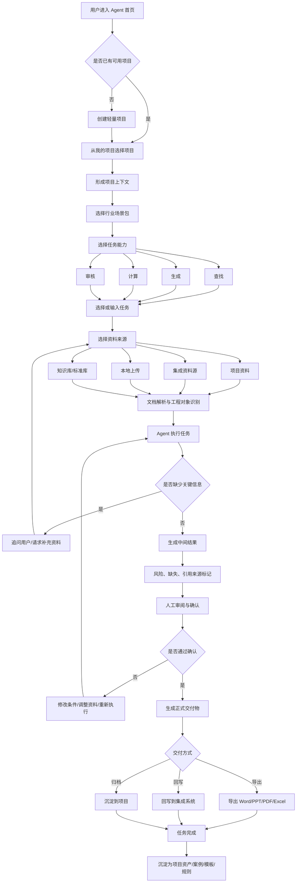
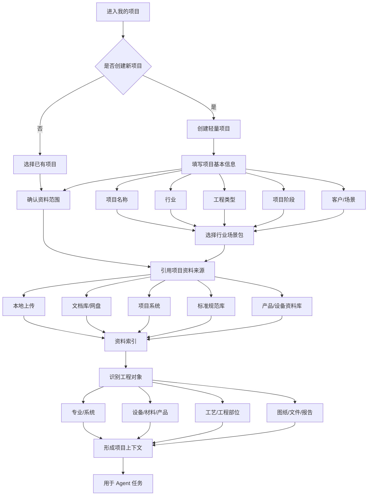
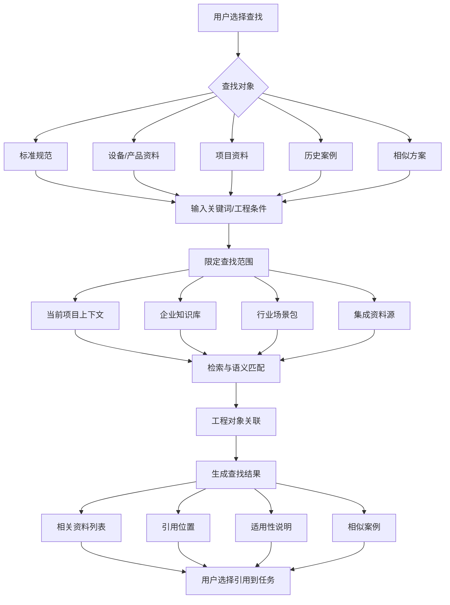
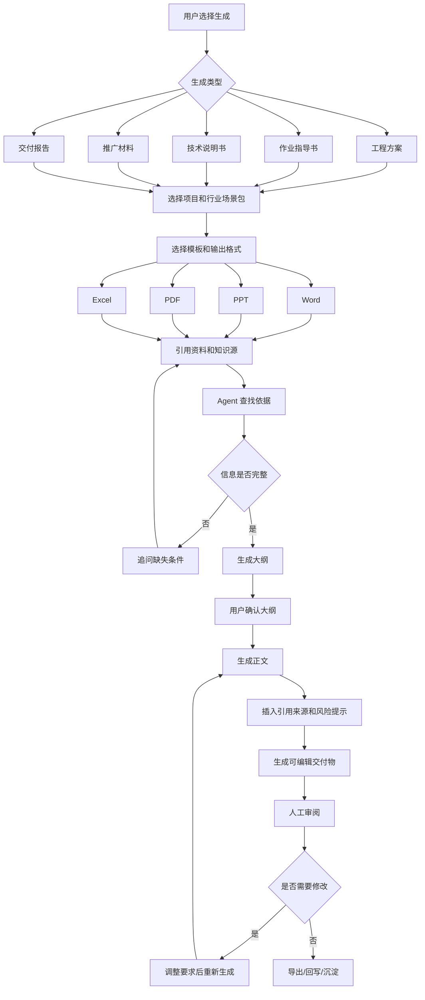
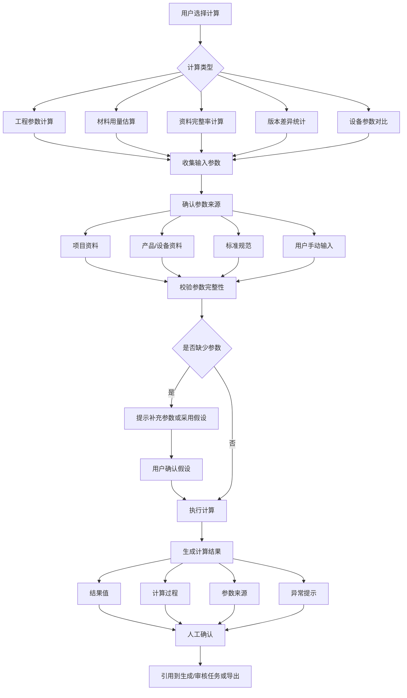
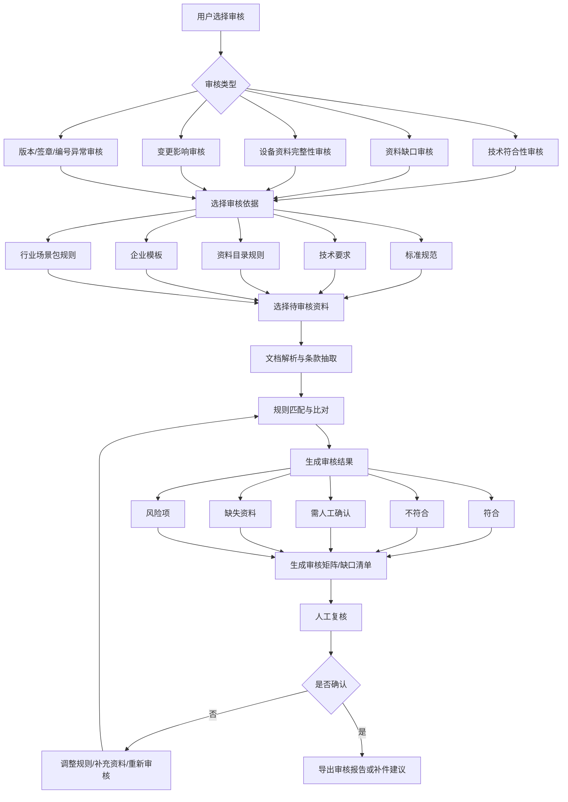
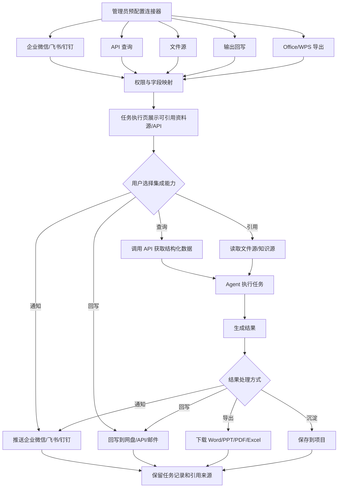
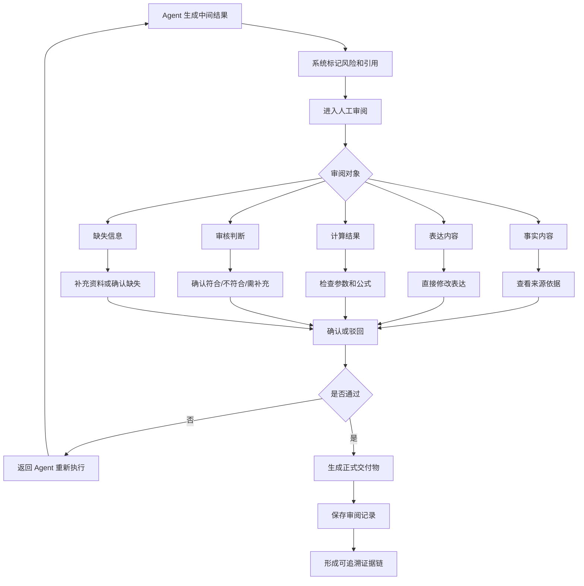
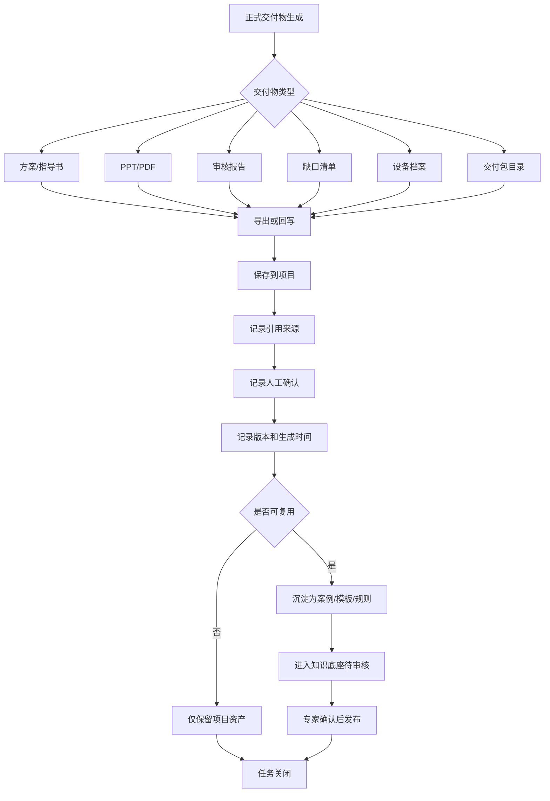

# 工程文档 Agent 业务流程图

本文档基于 `engineering-document-agent-product-plan.md` 梳理业务流程，重点描述产品从我的项目、项目上下文、资料集成、任务执行、人工审阅到交付沉淀的端到端流程。

## 1. 总体业务流程

## 2. 我的项目与项目上下文准备流程

## 3. 查找类业务流程

## 4. 生成类业务流程

## 5. 计算类业务流程

## 6. 审核类业务流程

## 7. 集成与回写流程

## 8. 人工审阅与追溯流程

## 9. 交付与沉淀流程

