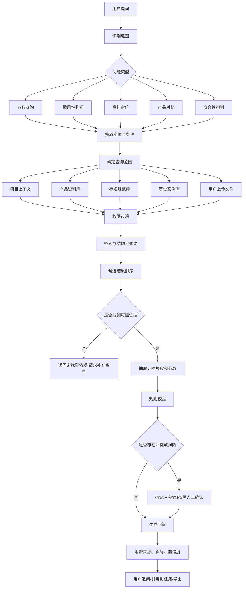
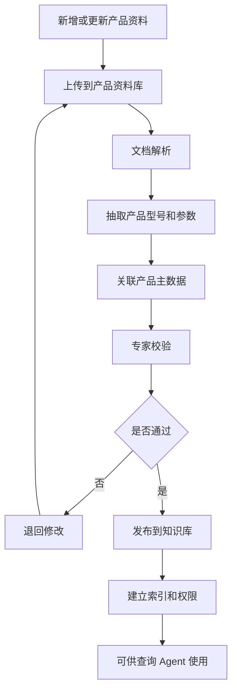

# 产品资料查询（问答）Agent 详细流程

本文档以“查询/问答产品资料”为例，拆解工程文档 Agent 在查找类任务中的输入、输出、数据、知识库、规则、流程和异常处理。

## 1. 场景定义

产品资料查询不是普通聊天问答，而是面向工程场景的受控检索与回答。

用户希望快速回答：

- 某个产品是否适用于某个工程场景？
- 某个产品的关键参数是多少？
- 某个施工条件、适用范围、限制条件在哪里写明？
- 某个产品和另一个产品有什么差异？
- 某个产品是否满足客户技术要求？
- 能否引用某份 TDS、SDS、检测报告、认证或案例作为依据？

该场景属于四类能力中的“查找”，但经常联动：

- 生成：把查询结果写入方案、指导书、PPT。
- 计算：基于产品参数计算用量、膜厚、消耗量、设备选型参数。
- 审核：判断产品资料是否满足技术要求或资料是否缺失。

## 2. 典型用户

| 用户 | 典型问题 |
| --- | --- |
| 技术销售 | 这个产品能不能用于客户这个工况？有什么依据？ |
| 应用工程师 | 某个底材、温湿度、腐蚀等级下推荐哪个体系？ |
| 产品经理 | 某个产品的参数、认证、检测报告在哪里？ |
| 项目工程师 | 当前项目使用的产品资料是否齐全？ |
| 资料负责人 | 交付包里某个产品缺哪些 TDS、SDS、合格证、检测报告？ |

## 3. 输入细节

### 3.1 用户自然语言输入

示例：

- “帮我查一下 A-102 环氧底漆的重涂间隔和适用底材。”
- “这个产品能不能用于沿海 C5-M 钢结构项目？”
- “找出适用于混凝土地坪、耐磨、耐化学腐蚀的产品资料。”
- “A-102 和 B-210 的固含、VOC、干燥时间有什么区别？”
- “客户要求 VOC 小于 420g/L，我们哪些产品满足？”

需要解析的字段：

| 字段 | 示例 |
| --- | --- |
| 产品名称/型号 | A-102、B-210、环氧底漆 |
| 应用场景 | 沿海钢结构、混凝土地坪、储罐内壁 |
| 工况条件 | C5-M、高湿、耐化学腐蚀、室外暴晒 |
| 查询参数 | VOC、固含、干燥时间、重涂间隔、膜厚 |
| 约束条件 | VOC 小于 420g/L、设计寿命 15 年 |
| 输出意图 | 查资料、做对比、给推荐、引用依据 |

### 3.2 结构化输入

用户也可以通过表单或任务卡片输入：

| 输入项 | 是否必填 | 说明 |
| --- | --- | --- |
| 我的项目 | 建议必填 | 选择当前项目入口 |
| 项目上下文 | 自动形成 | 限定资料范围、权限和输出归属 |
| 行业场景包 | 必填 | 例如涂料、装备制造、电力设备、化工设备 |
| 产品名称/型号 | 条件必填 | 明确查询对象 |
| 应用场景 | 可选 | 用于判断适用性 |
| 查询参数 | 可选 | 例如 VOC、膜厚、用量、温湿度限制 |
| 技术要求 | 可选 | 用于符合性判断 |
| 输出格式 | 可选 | 简答、表格、对比表、引用清单 |
| 资料范围 | 可选 | 当前项目、企业产品库、标准库、历史案例 |

### 3.3 文件输入

用户可上传或引用：

- 产品 TDS。
- SDS。
- 检测报告。
- 认证证书。
- 产品手册。
- 施工工艺文件。
- 历史方案。
- 客户技术要求。
- 项目资料目录。

系统需要识别：

- 文件类型。
- 产品型号。
- 文件版本。
- 发布日期。
- 适用范围。
- 参数表。
- 安全信息。
- 检测结论。
- 认证范围。
- 是否过期或被替代。

## 4. 所需数据

### 4.1 产品主数据

| 数据项 | 示例 |
| --- | --- |
| 产品 ID | PROD-A-102 |
| 产品名称 | A-102 环氧底漆 |
| 产品类别 | 底漆、中间漆、面漆、防腐涂料、防火涂料 |
| 产品系列 | 工业防腐系列 |
| 适用底材 | 钢结构、混凝土、镀锌钢 |
| 适用环境 | C3、C4、C5-M、化工腐蚀、高温 |
| 推荐体系 | 底漆+中间漆+面漆 |
| 状态 | 在售、停用、替代、受限 |
| 替代产品 | B-210 |

### 4.2 产品参数数据

| 参数 | 示例 |
| --- | --- |
| 体积固含 | 65% |
| VOC | 380 g/L |
| 理论涂布率 | 8.1 m2/L @ 80um |
| 推荐干膜厚度 | 80um |
| 表干时间 | 2h @ 25C |
| 实干时间 | 24h @ 25C |
| 重涂间隔 | 最短 6h，最长 7d @ 25C |
| 混合比例 | A:B = 4:1 |
| 适用温度 | 5-40C |
| 相对湿度限制 | <= 85% |
| 闪点 | 28C |

### 4.3 资料文件数据

| 数据项 | 说明 |
| --- | --- |
| 文件 ID | 唯一文件标识 |
| 文件类型 | TDS、SDS、检测报告、认证、案例、说明书 |
| 文件名称 | A-102_TDS_2025.pdf |
| 产品关联 | 关联产品 ID |
| 版本 | V3.2 |
| 日期 | 发布/生效/过期日期 |
| 语言 | 中文、英文 |
| 权限 | 哪些用户、项目、角色可见 |
| 来源系统 | 产品库、网盘、项目、DMS |
| 原文页码 | 参数或结论所在页 |

### 4.4 应用场景数据

| 数据项 | 示例 |
| --- | --- |
| 底材 | 钢结构、混凝土、铝材 |
| 环境 | 海洋大气、化工厂、地下、室内 |
| 腐蚀等级 | C3、C4、C5-M、CX |
| 设计寿命 | 5 年、10 年、15 年、25 年 |
| 施工方式 | 喷涂、辊涂、刷涂 |
| 施工限制 | 低温、高湿、短工期、带锈施工 |
| 验收指标 | 膜厚、附着力、耐盐雾、VOC |

### 4.5 标准与规则数据

| 数据项 | 示例 |
| --- | --- |
| 标准编号 | ISO 12944、GB/T、HG/T |
| 适用范围 | 钢结构防腐、地坪、饮用水接触材料 |
| 条款 | 腐蚀等级、膜厚、表面处理、测试要求 |
| 企业规则 | 某产品不得用于长期浸水 |
| 客户规则 | VOC < 420g/L |
| 审核规则 | 参数缺失时必须标记“需人工确认” |

## 5. 知识库设计

### 5.1 知识库分层

```text
产品资料知识库
├── 产品主数据
├── 产品参数库
├── TDS 知识库
├── SDS 知识库
├── 检测报告库
├── 认证证书库
├── 应用案例库
├── 施工工艺库
├── 标准规范库
├── 竞品/替代关系库
└── 历史问答与专家确认库
```

### 5.2 检索方式

| 检索方式 | 用途 |
| --- | --- |
| 精确检索 | 产品型号、文件编号、标准编号 |
| 语义检索 | 场景、问题、应用需求 |
| 结构化过滤 | 产品类别、底材、环境、日期、版本、状态 |
| 参数检索 | VOC、膜厚、固含、温湿度、干燥时间 |
| 关系检索 | 产品-体系、产品-资料、产品-案例、产品-替代 |
| 权限过滤 | 按用户、项目、组织、资料密级过滤 |

### 5.3 索引字段

每份资料应建立以下索引：

- 产品名称。
- 产品型号。
- 文件类型。
- 文件版本。
- 发布日期。
- 适用底材。
- 适用环境。
- 关键参数。
- 认证范围。
- 检测项目。
- 标准编号。
- 原文页码。
- 来源系统。
- 权限标签。

## 6. 规则设计

### 6.1 查询规则

- 产品型号精确匹配优先于语义匹配。
- 当前有效版本优先于历史版本。
- 当前项目上下文中的资料优先于企业通用资料。
- 企业正式产品库优先于用户临时上传文件。
- 有结构化参数时，优先使用结构化参数；无结构化参数时再引用文档抽取结果。
- 所有事实性回答必须提供来源。

### 6.2 回答规则

- 不允许编造产品参数。
- 参数冲突时必须列出冲突来源，并标记需人工确认。
- 资料缺失时必须明确说“未找到依据”。
- 适用性判断必须区分“明确支持”“明确不支持”“资料不足，需确认”。
- 安全、环保、合规类内容必须引用 SDS、标准或认证。
- 涉及工程选型时，必须说明假设条件。
- 停用或被替代产品必须提示。

### 6.3 权限规则

- 用户只能查询系统权限允许的项目、资料源和知识源。
- 跨项目资料默认不可引用，除非被授权为企业案例或公共知识。
- 外部协作方不可访问内部成本、配方、未发布产品资料。
- 回答中不得泄露无权限文件名或片段。
- 导出结果继承引用资料的权限标签。

### 6.4 质量规则

- 回答必须包含来源文件和页码/章节。
- 低置信度结果需要标记。
- 多来源不一致时不得给唯一结论。
- 过期资料不得作为默认依据。
- 用户上传的临时文件只能作为当前任务依据，不能自动进入企业知识库。

## 7. 详细流程

### 7.1 端到端流程图



### 7.2 处理步骤

| 步骤 | 系统动作 | 关键判断 |
| --- | --- | --- |
| 1. 意图识别 | 判断用户是查参数、找资料、做对比、问适用性还是做符合性初判 | 是否需要结构化字段 |
| 2. 实体抽取 | 抽取产品型号、场景、参数、标准、约束条件 | 产品是否唯一 |
| 3. 查询范围确定 | 选择项目上下文、产品库、标准库、历史案例或上传文件 | 是否受权限限制 |
| 4. 权限过滤 | 过滤无权限资料 | 是否可显示文件名 |
| 5. 检索 | 结合精确检索、语义检索、参数检索 | 是否命中有效版本 |
| 6. 证据抽取 | 抽取参数、条款、结论和页码 | 是否为事实依据 |
| 7. 规则校验 | 校验版本、状态、冲突、适用性、安全合规 | 是否需人工确认 |
| 8. 答案生成 | 生成简答、表格、对比或建议 | 是否有来源 |
| 9. 输出处理 | 可追问、引用到方案/审核任务、导出 | 是否沉淀为知识 |

## 8. 输出细节

### 8.1 简答型输出

示例：

```text
A-102 环氧底漆在 25C 条件下的最短重涂间隔为 6 小时，最长重涂间隔为 7 天。

依据：
- A-102_TDS_V3.2.pdf，第 2 页，“施工参数”章节。

注意：
- 上述数据基于 25C 条件；低温或高湿环境下需要重新确认。
```

### 8.2 表格型输出

| 参数 | 数值 | 条件 | 来源 | 置信度 |
| --- | --- | --- | --- | --- |
| VOC | 380 g/L | 标准状态 | A-102_TDS_V3.2.pdf p.1 | 高 |
| 推荐干膜厚度 | 80um | 单道 | A-102_TDS_V3.2.pdf p.2 | 高 |
| 重涂间隔 | 6h-7d | 25C | A-102_TDS_V3.2.pdf p.2 | 高 |

### 8.3 对比型输出

| 对比项 | A-102 | B-210 | 结论 |
| --- | --- | --- | --- |
| 产品类别 | 环氧底漆 | 环氧底漆 | 同类 |
| VOC | 380 g/L | 420 g/L | A-102 更低 |
| 推荐底材 | 钢结构 | 钢结构、镀锌钢 | B-210 适用面更广 |
| 状态 | 在售 | 在售 | 均可选 |

### 8.4 适用性判断输出

```text
结论：资料显示 A-102 可用于钢结构防腐底漆，但当前资料不足以直接确认其适用于“沿海 C5-M、设计寿命 15 年”的完整体系。

已找到依据：
- 支持钢结构底材：A-102_TDS_V3.2.pdf，第 1 页。
- 推荐干膜厚度 80um：A-102_TDS_V3.2.pdf，第 2 页。

缺失信息：
- 未找到 C5-M 体系认证或对应配套体系说明。
- 未找到 15 年设计寿命的检测或案例依据。

建议：
- 补充配套中间漆、面漆资料。
- 查询 ISO 12944 对 C5-M 的体系要求。
- 由应用工程师确认最终体系。
```

### 8.5 未找到依据输出

```text
未在当前项目上下文和企业产品资料库中找到 A-102 用于饮用水接触场景的认证依据。

已查询范围：
- 当前项目资料。
- 企业产品 TDS/SDS。
- 检测报告库。
- 认证证书库。

建议：
- 上传相关认证文件。
- 扩大查询范围到历史项目案例。
- 请产品经理确认是否存在未入库资料。
```

## 9. 异常与边界情况

| 情况 | 系统处理 |
| --- | --- |
| 产品名称模糊 | 返回候选产品列表，请用户选择 |
| 产品参数冲突 | 展示冲突来源，不给唯一结论 |
| 找到旧版本资料 | 提示版本过期，优先使用新版本 |
| 资料无权限 | 不展示具体内容，提示权限不足 |
| 用户问题超出资料依据 | 标记未找到依据，不编造 |
| 涉及安全环保 | 必须引用 SDS、认证或标准 |
| 涉及工程选型 | 输出假设条件和需人工确认项 |
| 上传临时文件 | 仅当前任务可用，不自动入库 |

## 10. 需要配置的后台能力

### 10.1 管理配置

- 产品主数据维护。
- 产品参数字段维护。
- 文件类型与解析模板配置。
- 产品-资料关联。
- 产品-体系关联。
- 产品-标准关联。
- 产品-案例关联。
- 权限标签配置。
- 版本状态配置。

### 10.2 知识更新流程



## 11. 与其他任务的联动

| 查询结果 | 可联动任务 |
| --- | --- |
| 产品参数 | 材料用量估算、工程参数计算 |
| 适用性依据 | 工程方案生成、技术符合性审核 |
| TDS/SDS | 作业指导书生成、安全环保章节生成 |
| 检测报告/认证 | 客户推广材料、审查报告 |
| 缺失资料 | 资料缺口审核、补件建议 |
| 产品对比 | 竞品替代方案、选型建议 |

## 12. 成功标准

该场景的产品成功标准：

- 用户能用自然语言查到可信产品资料。
- 事实性回答都有来源。
- 参数冲突、资料缺失、版本过期能被明确提示。
- 回答能直接引用到方案、指导书、审核报告或 PPT。
- 查询范围受我的项目、项目上下文和系统权限控制。
- 产品资料更新后，知识库能及时同步并可追溯。
