# 工程行业文档 Agent 流程图与信息架构图

本文档基于 `engineering-document-agent-product-plan.md` 梳理，包含产品总流程、核心 Agent 工作流、信息架构、行业场景包架构和知识流。

## 1. 产品总流程图

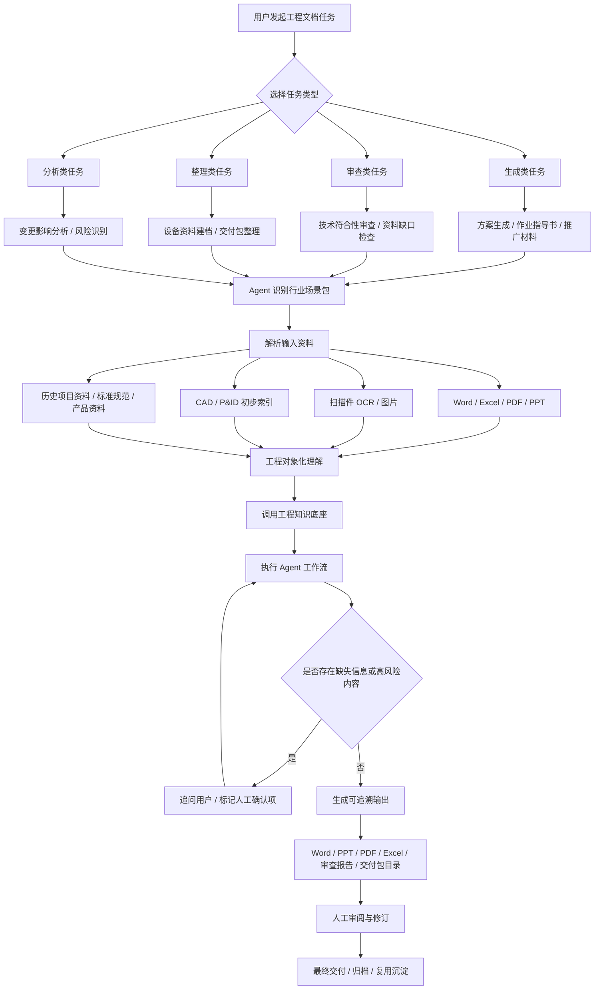

## 2. Agent 通用工作流

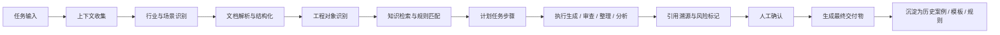

## 3. 生成类任务流程图

适用于工程方案、作业指导书、操作规程、产品推广材料、技术说明书等。

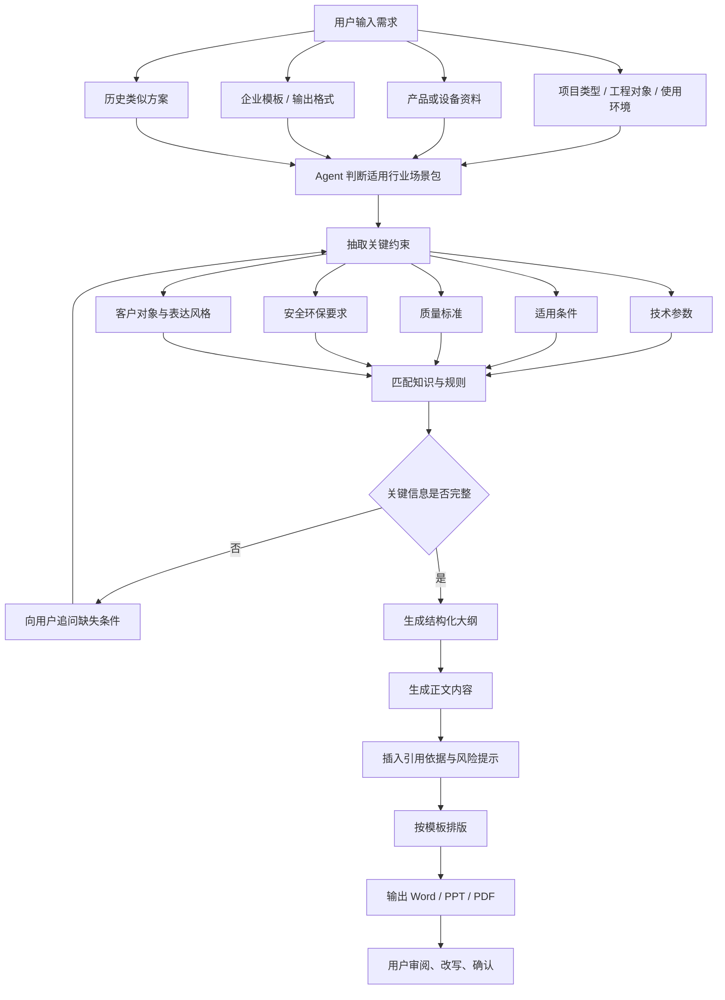

## 4. 审查类任务流程图

适用于技术要求抽取、符合性审查、资料缺口检查、交付包检查等。

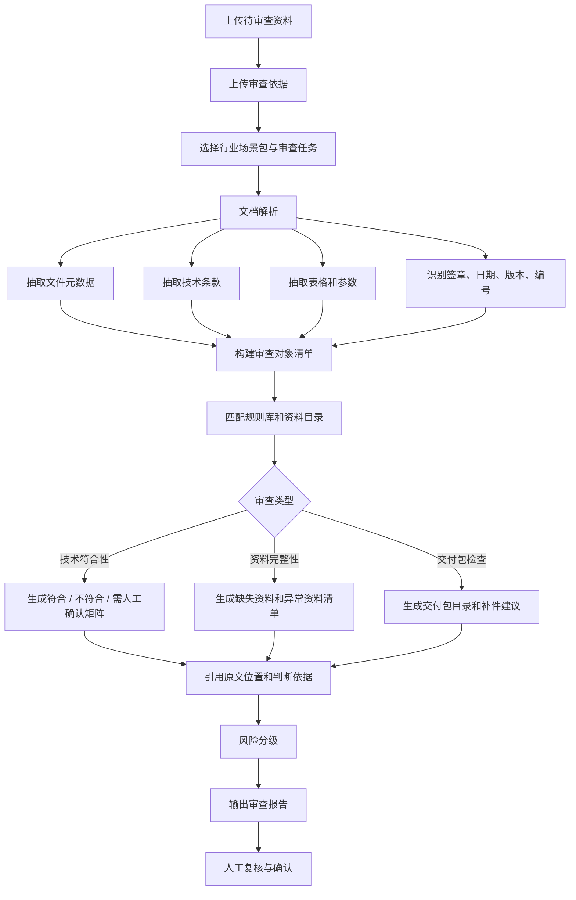

## 5. 设备资料建档与运维移交流程图

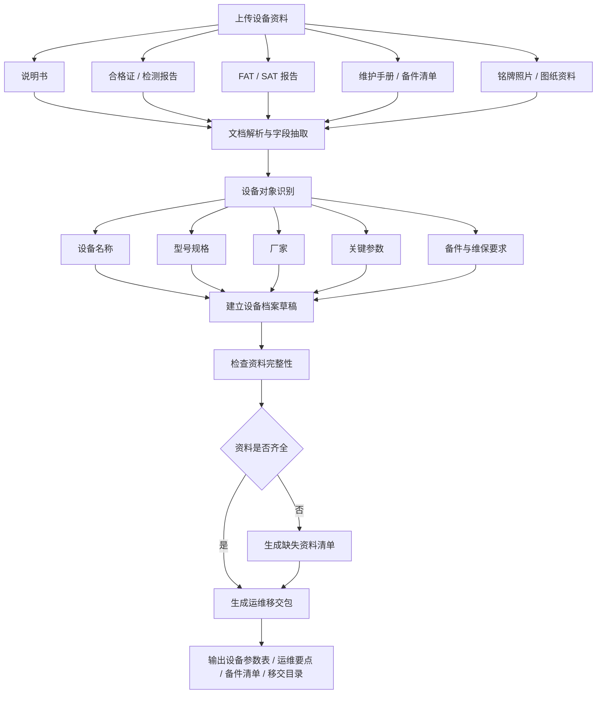

## 6. 变更影响分析流程图

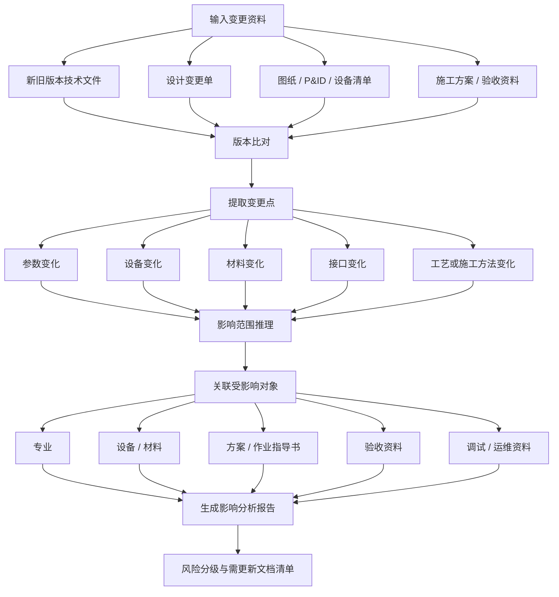

## 7. 产品信息架构图

```mermaid
flowchart TD
    A["工程文档 Agent"] --> B["Agent 首页"]
    A --> C["我的项目"]
    A --> D["任务执行页"]
    A --> E["行业场景"]
    A --> F["配置中心"]
    A --> G["集成中心"]
    A --> H["我的交付物"]

    B --> B1["新任务"]
    B --> B2["最近任务"]
    B --> B3["查找"]
    B --> B4["生成"]
    B --> B5["计算"]
    B --> B6["审核"]
    B --> B7["底部任务输入框"]

    C --> C1["最近访问"]
    C --> C2["我参与的"]
    C --> C3["我创建的"]
    C --> C4["已收藏"]
    C --> C5["全部项目（按权限）"]

    D --> D1["任务上下文"]
    D --> D2["资料引用"]
    D --> D3["Agent 执行过程"]
    D --> D4["中间结果"]
    D --> D5["风险与缺失信息"]
    D --> D6["引用溯源"]
    D --> D7["导出/回写"]

    E --> E1["涂料"]
    E --> E2["装备制造"]
    E --> E3["电力"]
    E --> E4["化工"]
    E --> E5["能源"]
    E --> E6["轨道交通"]
    E --> E7["建筑/基建"]
    E --> E8["水利/矿山"]

    F --> F1["模板配置"]
    F --> F2["行业包配置"]
    F --> F3["规则配置"]
    F --> F4["知识源配置"]
    F --> F5["集成配置"]
    F --> F6["用户与权限"]

    F1 --> F11["PPT / Word / Excel / 内容 / 交付包模板"]
    F2 --> F21["术语 / 工程对象 / 文档类型 / 默认模板 / 默认规则"]
    F3 --> F31["数据来源 / 引用 / 生成 / 审核 / 权限 / 风险 / 格式 / 计算规则"]

    G --> G1["企业微信/飞书/钉钉"]
    G --> G2["API 查询"]
    G --> G3["文件源"]
    G --> G4["输出回写"]
    G --> G5["Office/WPS 导出"]

    H --> H1["PPT"]
    H --> H2["Word"]
    H --> H3["Excel"]
    H --> H4["审核报告"]
    H --> H5["缺口清单"]
```

## 8. 行业场景包架构图

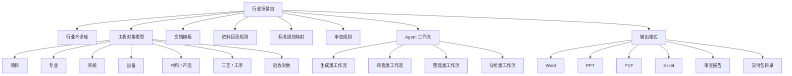

## 9. 知识与数据流图

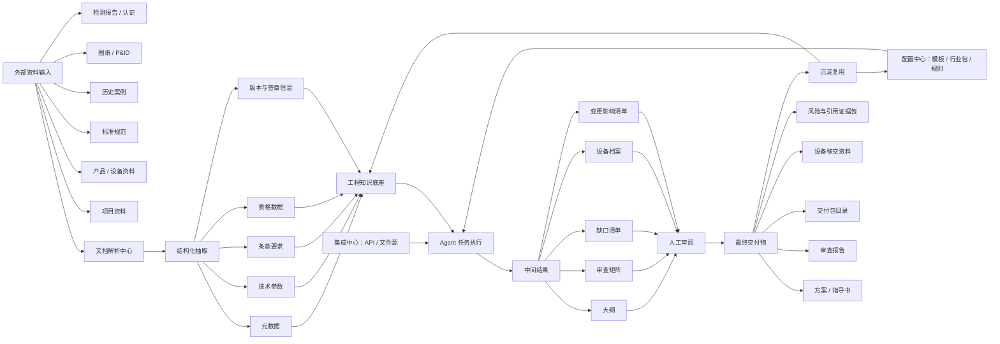

## 10. 用户角色与任务关系图

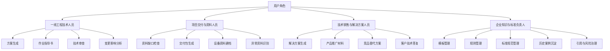

## 11. MVP 流程图

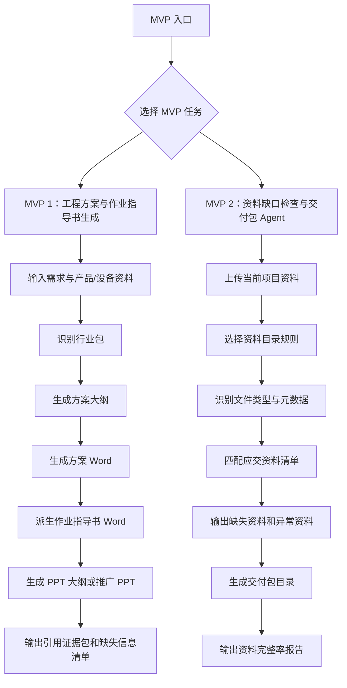
