# 工程行业文档 Agent 产品结构右向展开图

本文档基于 `docs/product/engineering-document-agent-product-plan.md` 与 `prototypes/engineering-document-agent-product-introduction-infographic.html` 梳理，综合产品功能结构图与信息结构图，将产品原型拆解到可交互的原子操作层级。

## 1. 综合产品结构右向展开图

> 阅读方式：先看 1.1 总览主链路，再看 1.2 到 1.8 的分区详图。每张图控制节点数量，避免 Mermaid 自动缩放导致字体过小。

### 1.1 总览主链路

```mermaid
%%{init: {"theme": "base", "flowchart": {"htmlLabels": true, "nodeSpacing": 70, "rankSpacing": 95}, "themeVariables": {"fontSize": "22px", "fontFamily": "PingFang SC, Microsoft YaHei, Arial", "lineColor": "#7b8b8e"}} }%%
flowchart LR
    A["工程行业文档 Agent"] --> B["产品定位"]
    B --> C["用户与权限"]
    C --> D["信息入口"]
    D --> E["任务作业闭环"]
    E --> F["四类 AI 能力"]
    F --> G["知识资产中心"]
    G --> H["配置与治理"]
    H --> I["集成与交付"]
    I --> J["交付物与沉淀"]
```

### 1.2 产品定位与用户权限

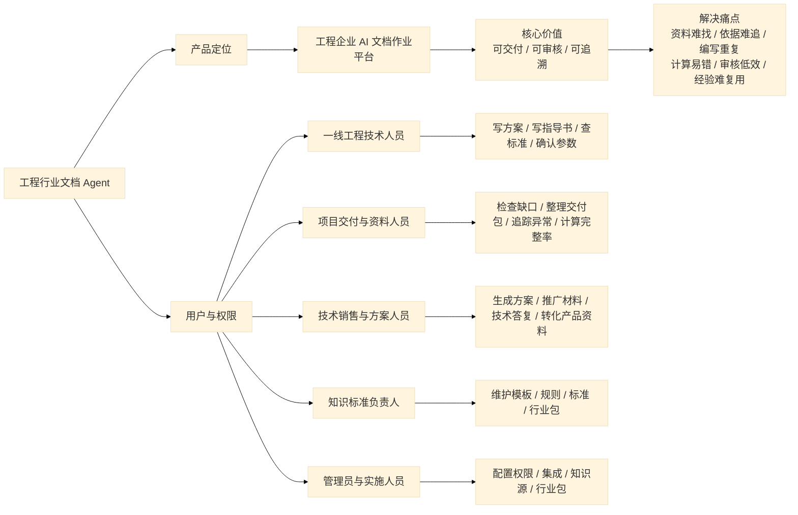

### 1.3 信息入口

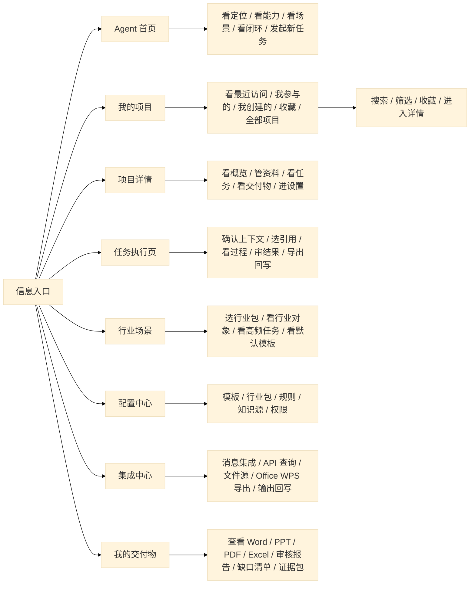

### 1.4 任务作业闭环

```mermaid
%%{init: {"theme": "base", "flowchart": {"htmlLabels": true, "nodeSpacing": 65, "rankSpacing": 90}, "themeVariables": {"fontSize": "20px", "fontFamily": "PingFang SC, Microsoft YaHei, Arial"}} }%%
flowchart LR
    A["任务作业闭环"] --> B["创建任务"]
    B --> B1["选任务类型 / 选行业包 / 选项目 / 输入目标 / 选输出格式"]
    B1 --> C["上下文确认"]
    C --> C1["确认工程对象 / 资料范围 / 权限约束 / 输出归属 / 已知参数"]
    C1 --> D["资料引用"]
    D --> D1["上传文件 / 选项目资料 / 选知识库 / 调 API / 看来源 / 移除引用"]
    D1 --> E["Agent 执行"]
    E --> E1["解析资料 / 识别对象 / 提取参数 / 匹配规则 / 生成中间结果 / 标记风险"]
    E1 --> F["人工确认"]
    F --> F1["回答追问 / 确认参数 / 确认假设 / 确认风险 / 批注修改 / 版本对比"]
    F1 --> G["结果交付"]
    G --> G1["审阅正文 / 矩阵 / 缺口清单 / 证据包"]
    G1 --> G2["导出 Word / PPT / PDF / Excel / 推送消息 / 回写系统"]
```

### 1.5 四类 AI 能力

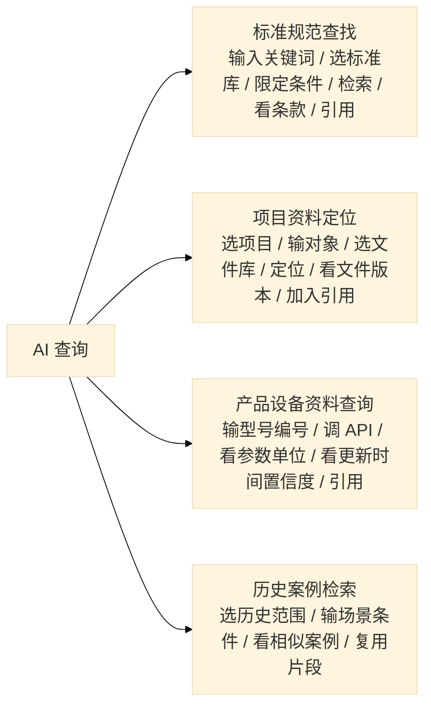

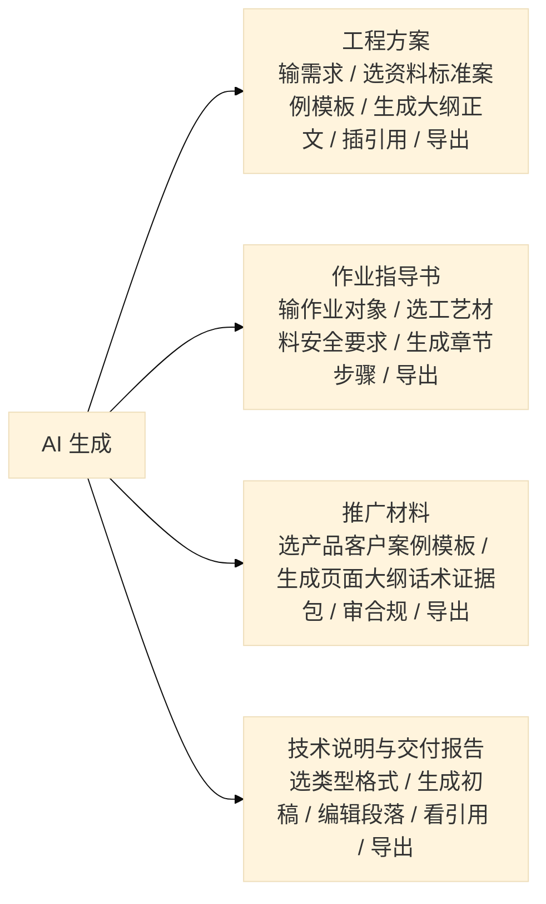

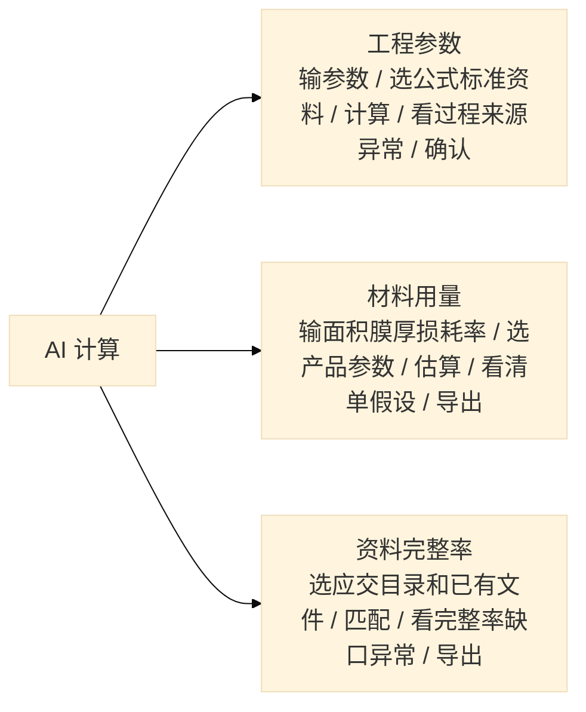

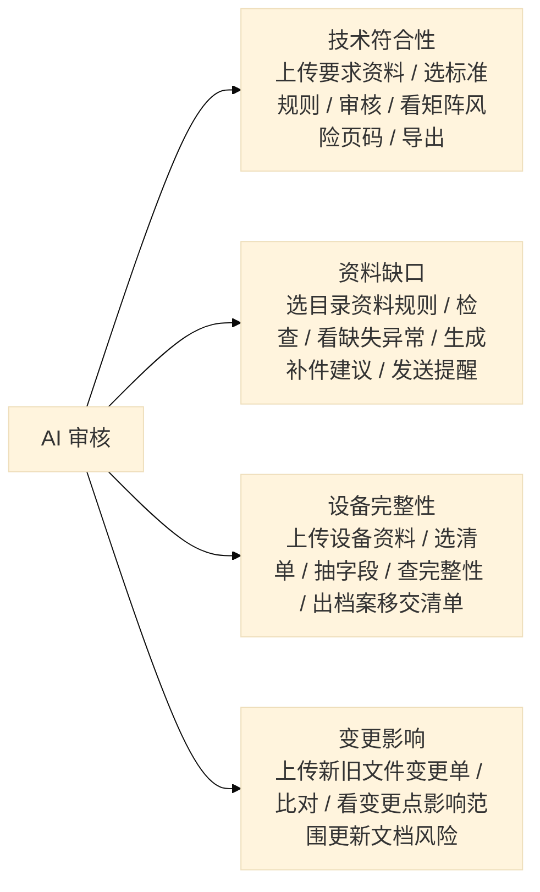

### 1.6 知识资产、配置治理与集成交付

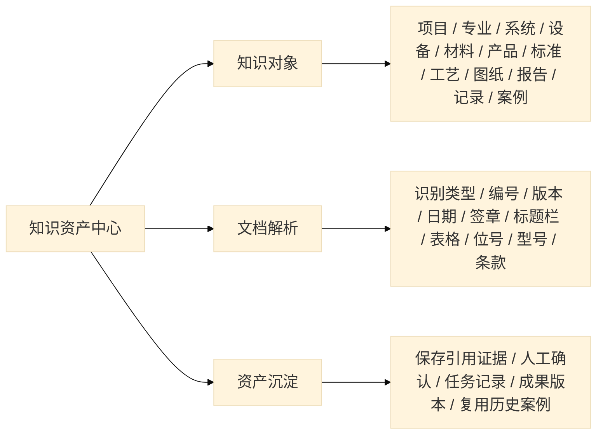

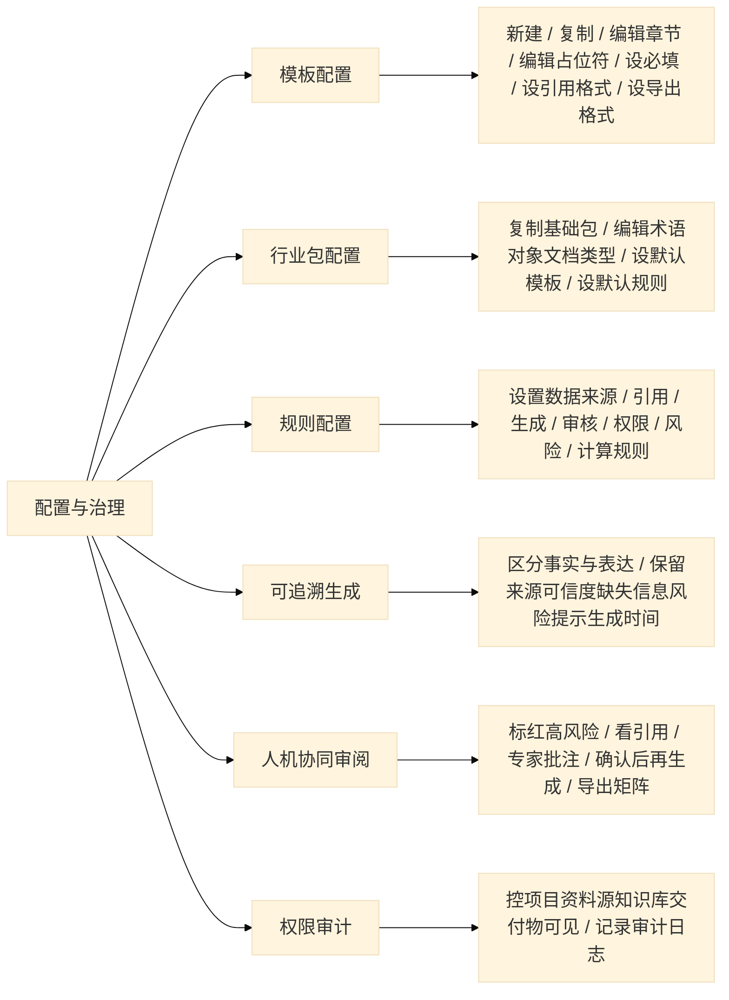

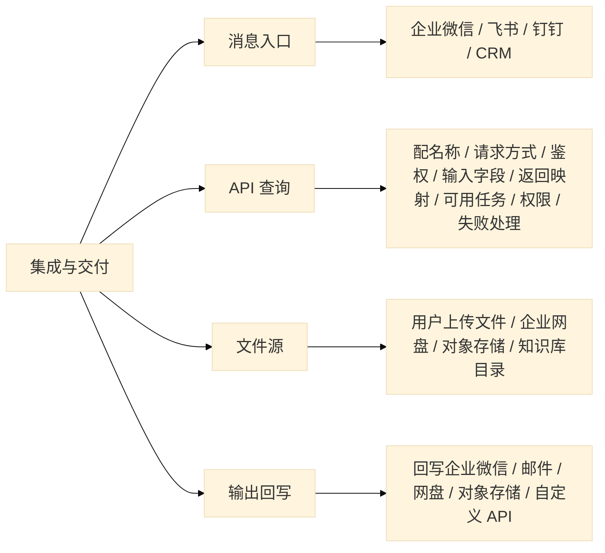

### 1.7 交付物与沉淀

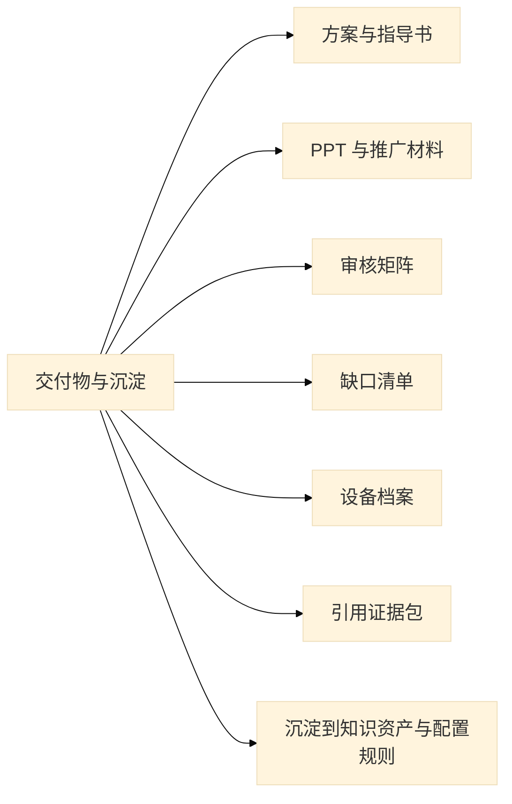

### 1.8 原子操作横向索引

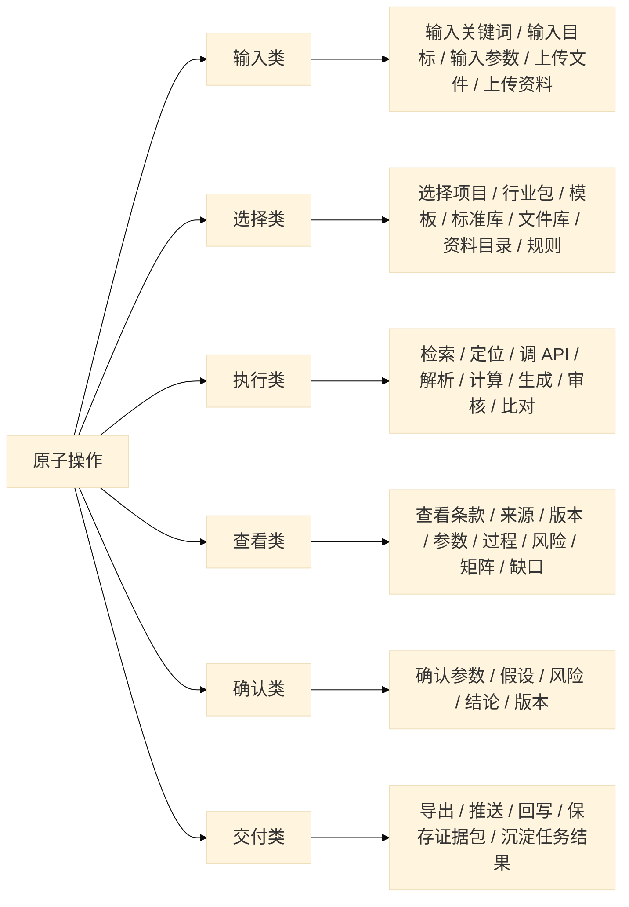

### 1.9 附录：完整节点清单，不渲染

```text
flowchart LR
    A["工程行业文档 Agent"] --> B["产品定位"]
    B --> C["用户与权限"]
    C --> D["信息入口"]
    D --> E["任务作业闭环"]
    E --> F["四类 AI 能力"]
    F --> G["知识资产中心"]
    G --> H["配置与治理"]
    H --> I["集成与交付"]
    I --> J["交付物与沉淀"]

    B --> B1["工程企业 AI 文档作业平台"]
    B1 --> B2["核心价值：可交付 / 可审核 / 可追溯"]
    B2 --> B3["解决痛点：资料难找 / 依据难追 / 编写重复 / 计算易错 / 审核低效 / 经验难复用"]

    C --> C1["一线工程技术人员"]
    C1 --> C11["写方案 / 写指导书 / 查标准 / 确认参数"]
    C --> C2["项目交付与资料人员"]
    C2 --> C21["检查缺口 / 整理交付包 / 追踪异常 / 计算完整率"]
    C --> C3["技术销售与方案人员"]
    C3 --> C31["生成方案 / 生成推广材料 / 生成技术答复 / 转化产品资料"]
    C --> C4["知识标准负责人"]
    C4 --> C41["维护模板 / 规则 / 标准 / 行业包"]
    C --> C5["管理员与实施人员"]
    C5 --> C51["配置权限 / 集成 / 知识源 / 行业包"]

    D --> D1["Agent 首页"]
    D1 --> D11["看定位 / 看能力 / 看场景 / 看闭环 / 发起新任务"]
    D --> D2["我的项目"]
    D2 --> D21["看最近访问 / 我参与的 / 我创建的 / 收藏 / 全部项目"]
    D21 --> D22["搜索 / 筛选 / 收藏 / 进入详情"]
    D --> D3["项目详情"]
    D3 --> D31["看概览 / 管资料 / 看任务 / 看交付物 / 进设置"]
    D --> D4["任务执行页"]
    D4 --> D41["确认上下文 / 选引用 / 看过程 / 审结果 / 导出回写"]
    D --> D5["行业场景"]
    D5 --> D51["选行业包 / 看行业对象 / 看高频任务 / 看默认模板"]
    D --> D6["配置中心"]
    D6 --> D61["模板 / 行业包 / 规则 / 知识源 / 权限"]
    D --> D7["集成中心"]
    D7 --> D71["消息集成 / API 查询 / 文件源 / Office WPS 导出 / 输出回写"]
    D --> D8["我的交付物"]
    D8 --> D81["查看 Word / PPT / PDF / Excel / 审核报告 / 缺口清单 / 证据包"]

    E --> E1["创建任务"]
    E1 --> E11["选任务类型 / 选行业包 / 选项目 / 输入目标 / 选输出格式"]
    E --> E2["上下文确认"]
    E2 --> E21["确认工程对象 / 资料范围 / 权限约束 / 输出归属 / 已知参数"]
    E --> E3["资料引用"]
    E3 --> E31["上传文件 / 选项目资料 / 选知识库 / 调 API / 看来源 / 移除引用"]
    E --> E4["Agent 执行"]
    E4 --> E41["解析资料 / 识别对象 / 提取参数 / 匹配规则 / 生成中间结果 / 标记风险"]
    E --> E5["人工确认"]
    E5 --> E51["回答追问 / 确认参数 / 确认假设 / 确认风险 / 批注修改 / 版本对比"]
    E --> E6["结果交付"]
    E6 --> E61["审阅正文 / 矩阵 / 缺口清单 / 证据包"]
    E61 --> E62["导出 Word / PPT / PDF / Excel / 推送消息 / 回写系统"]

    F --> F1["AI 查询"]
    F1 --> F11["标准规范查找：输入关键词 / 选标准库 / 限定条件 / 检索 / 看条款 / 引用"]
    F1 --> F12["项目资料定位：选项目 / 输对象 / 选文件库 / 定位 / 看文件版本 / 加入引用"]
    F1 --> F13["产品设备资料查询：输型号编号 / 调 API / 看参数单位 / 看更新时间置信度 / 引用"]
    F1 --> F14["历史案例检索：选历史范围 / 输场景条件 / 看相似案例 / 复用片段"]
    F --> F2["AI 生成"]
    F2 --> F21["工程方案：输需求 / 选资料标准案例模板 / 生成大纲正文 / 插引用 / 导出"]
    F2 --> F22["作业指导书：输作业对象 / 选工艺材料安全要求 / 生成章节步骤 / 导出"]
    F2 --> F23["推广材料：选产品客户案例模板 / 生成页面大纲话术证据包 / 审合规 / 导出"]
    F2 --> F24["技术说明与交付报告：选类型格式 / 生成初稿 / 编辑段落 / 看引用 / 导出"]
    F --> F3["AI 计算"]
    F3 --> F31["工程参数：输参数 / 选公式标准资料 / 计算 / 看过程来源异常 / 确认"]
    F3 --> F32["材料用量：输面积膜厚损耗率 / 选产品参数 / 估算 / 看清单假设 / 导出"]
    F3 --> F33["资料完整率：选应交目录和已有文件 / 匹配 / 看完整率缺口异常 / 导出"]
    F --> F4["AI 审核"]
    F4 --> F41["技术符合性：上传要求资料 / 选标准规则 / 审核 / 看矩阵风险页码 / 导出"]
    F4 --> F42["资料缺口：选目录资料规则 / 检查 / 看缺失异常 / 生成补件建议 / 发送提醒"]
    F4 --> F43["设备完整性：上传设备资料 / 选清单 / 抽字段 / 查完整性 / 出档案移交清单"]
    F4 --> F44["变更影响：上传新旧文件变更单 / 比对 / 看变更点影响范围更新文档风险"]

    G --> G1["知识对象"]
    G1 --> G11["项目 / 专业 / 系统 / 设备 / 材料 / 产品 / 标准 / 工艺 / 图纸 / 报告 / 记录 / 案例"]
    G --> G2["文档解析"]
    G2 --> G21["识别类型 / 编号 / 版本 / 日期 / 签章 / 标题栏 / 表格 / 位号 / 型号 / 条款"]
    G --> G3["资产沉淀"]
    G3 --> G31["保存引用证据 / 人工确认 / 任务记录 / 成果版本 / 复用历史案例"]

    H --> H1["模板配置"]
    H1 --> H11["新建 / 复制 / 编辑章节 / 编辑占位符 / 设必填 / 设引用格式 / 设导出格式"]
    H --> H2["行业包配置"]
    H2 --> H21["复制基础包 / 编辑术语对象文档类型 / 设默认模板 / 设默认规则"]
    H --> H3["规则配置"]
    H3 --> H31["设置数据来源 / 引用 / 生成 / 审核 / 权限 / 风险 / 计算规则"]
    H --> H4["可追溯生成"]
    H4 --> H41["区分事实与表达 / 保留来源可信度缺失信息风险提示生成时间"]
    H --> H5["人机协同审阅"]
    H5 --> H51["标红高风险 / 看引用 / 专家批注 / 确认后再生成 / 导出矩阵"]
    H --> H6["权限审计"]
    H6 --> H61["控项目资料源知识库交付物可见 / 记录审计日志"]

    I --> I1["消息入口"]
    I1 --> I11["企业微信 / 飞书 / 钉钉 / CRM"]
    I --> I2["API 查询"]
    I2 --> I21["配名称 / 请求方式 / 鉴权 / 输入字段 / 返回映射 / 可用任务 / 权限 / 失败处理"]
    I --> I3["文件源"]
    I3 --> I31["用户上传文件 / 企业网盘 / 对象存储 / 知识库目录"]
    I --> I4["输出回写"]
    I4 --> I41["回写企业微信 / 邮件 / 网盘 / 对象存储 / 自定义 API"]

    J --> J1["方案与指导书"]
    J --> J2["PPT 与推广材料"]
    J --> J3["审核矩阵"]
    J --> J4["缺口清单"]
    J --> J5["设备档案"]
    J --> J6["引用证据包"]
    J --> J7["沉淀到知识资产与配置规则"]
```

## 2. 产品信息结构图

```mermaid
flowchart TD
    A["工程行业文档 Agent"] --> B["Agent 首页"]
    A --> C["我的项目"]
    A --> D["任务执行页"]
    A --> E["行业场景"]
    A --> F["配置中心"]
    A --> G["集成中心"]
    A --> H["我的交付物"]

    B --> B1["产品定位"]
    B --> B2["核心能力框架"]
    B --> B3["适用人群与价值边界"]
    B --> B4["场景矩阵"]
    B --> B5["功能地图"]
    B --> B6["交付闭环"]
    B --> B7["关键判断"]
    B --> B8["新建任务入口"]

    C --> C1["最近访问"]
    C --> C2["我参与的"]
    C --> C3["我创建的"]
    C --> C4["已收藏"]
    C --> C5["全部项目（按权限）"]
    C --> C6["项目搜索与筛选"]
    C --> C7["项目详情"]

    C7 --> C71["项目概览"]
    C7 --> C72["项目资料"]
    C7 --> C73["Agent 任务记录"]
    C7 --> C74["交付物"]
    C7 --> C75["项目设置"]

    D --> D1["左侧：任务上下文"]
    D --> D2["中间：Agent 执行区"]
    D --> D3["右侧：结果与风险"]

    D1 --> D11["当前项目"]
    D1 --> D12["项目上下文"]
    D1 --> D13["行业场景包"]
    D1 --> D14["工程对象"]
    D1 --> D15["已上传资料"]
    D1 --> D16["已引用资料源"]
    D1 --> D17["已选模板"]
    D1 --> D18["输出格式"]

    D2 --> D21["正在解析资料"]
    D2 --> D22["已识别关键对象"]
    D2 --> D23["已提取关键参数"]
    D2 --> D24["已生成大纲"]
    D2 --> D25["待确认问题"]
    D2 --> D26["正文生成中"]
    D2 --> D27["审核矩阵生成中"]
    D2 --> D28["缺口清单生成中"]

    D3 --> D31["输出文档"]
    D3 --> D32["引用来源"]
    D3 --> D33["风险提示"]
    D3 --> D34["缺失信息"]
    D3 --> D35["需人工确认项"]
    D3 --> D36["导出 Word/PPT/PDF/Excel"]
    D3 --> D37["回写集成系统"]
    D3 --> D38["任务记录与版本"]

    E --> E1["涂料"]
    E --> E2["装备制造"]
    E --> E3["电力设备"]
    E --> E4["化工设备"]
    E --> E5["能源/电力/轨交/化工"]
    E --> E6["建筑/基建/水利/矿山"]

    F --> F1["模板配置"]
    F --> F2["行业包配置"]
    F --> F3["规则配置"]
    F --> F4["知识源配置"]
    F --> F5["用户与权限"]

    G --> G1["企业微信/飞书/钉钉"]
    G --> G2["API 查询"]
    G --> G3["文件源"]
    G --> G4["输出回写"]
    G --> G5["Office/WPS 导出"]

    H --> H1["方案与指导书"]
    H --> H2["PPT 与推广材料"]
    H --> H3["审核矩阵"]
    H --> H4["缺口清单"]
    H --> H5["设备档案"]
    H --> H6["引用证据包"]
```

## 3. 功能结构图

```mermaid
flowchart TD
    A["产品功能结构"] --> B["任务型 AI 能力"]
    A --> C["项目与上下文"]
    A --> D["知识资产"]
    A --> E["配置治理"]
    A --> F["集成交付"]

    B --> B1["AI 查询"]
    B --> B2["AI 生成"]
    B --> B3["AI 计算"]
    B --> B4["AI 审核"]

    B1 --> B11["标准规范查找"]
    B1 --> B12["项目资料定位"]
    B1 --> B13["产品/设备资料查询"]
    B1 --> B14["历史案例检索"]

    B2 --> B21["工程方案生成"]
    B2 --> B22["作业指导书生成"]
    B2 --> B23["技术说明书生成"]
    B2 --> B24["产品推广材料生成"]
    B2 --> B25["交付报告生成"]

    B3 --> B31["工程参数计算"]
    B3 --> B32["材料用量估算"]
    B3 --> B33["资料完整率计算"]
    B3 --> B34["版本差异统计"]

    B4 --> B41["技术符合性审核"]
    B4 --> B42["资料缺口审核"]
    B4 --> B43["设备资料完整性审核"]
    B4 --> B44["变更影响审核"]
    B4 --> B45["内容合规/广宣品审核"]

    C --> C1["我的项目"]
    C --> C2["项目详情"]
    C --> C3["项目上下文"]
    C --> C4["任务记录"]
    C --> C5["交付物归属"]

    D --> D1["标准规范"]
    D --> D2["案例经验"]
    D --> D3["模板资产"]
    D --> D4["规则资产"]
    D --> D5["项目成果"]
    D --> D6["文档解析与结构化"]

    E --> E1["模板配置"]
    E --> E2["行业包配置"]
    E --> E3["规则配置"]
    E --> E4["权限控制"]
    E --> E5["引用溯源"]
    E --> E6["人工复核"]
    E --> E7["审计日志"]

    F --> F1["消息入口"]
    F --> F2["API 查询连接器"]
    F --> F3["文件源连接器"]
    F --> F4["Office/WPS 导出"]
    F --> F5["系统回写"]
```

## 4. 任务执行页原子操作图

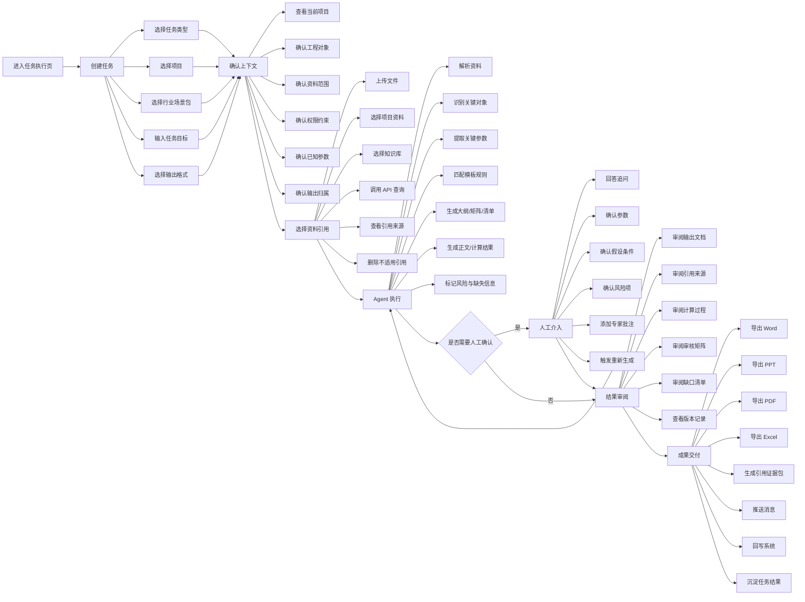

## 5. 原子操作清单

| 模块 | 原子操作 |
| --- | --- |
| Agent 首页 | 查看定位、查看能力、查看人群、查看场景、查看功能地图、查看闭环、点击新建任务 |
| 我的项目 | 查看列表、切换分组、搜索项目、筛选项目、收藏项目、进入详情、查看权限范围 |
| 项目详情 | 查看概览、上传资料、选择资料源、关联知识库、查看任务记录、查看交付物、编辑基础信息、配置资料范围、选择行业包、设置权限继承 |
| 创建任务 | 选择能力类型、选择具体任务、选择项目、选择行业包、输入工程对象、输入任务目标、选择模板、选择输出格式、确认创建 |
| 资料引用 | 上传文件、选择项目文件、选择标准库、选择产品资料、选择历史案例、调用 API、查看来源、加入引用、移除引用 |
| AI 查询 | 输入关键词、限定项目条件、执行检索、查看结果、打开来源、查看条款位置、查看版本、引用资料、保存结果 |
| AI 生成 | 输入需求、选择模板、生成大纲、编辑大纲、生成正文、编辑段落、插入引用、查看风险、确认版本、导出文件 |
| AI 计算 | 输入参数、选择公式、选择参数来源、执行计算、查看过程、查看异常、修改参数、确认结果、导出清单 |
| AI 审核 | 上传待审资料、选择审核依据、选择规则、执行审核、查看矩阵、查看风险、查看页码、确认结论、导出报告 |
| 人工确认 | 查看追问、补充信息、确认参数、确认假设、确认风险、添加批注、触发重算、触发重写、确认通过 |
| 交付物 | 预览 Word、预览 PPT、预览 PDF、预览 Excel、下载文件、复制链接、推送消息、回写 API、查看历史版本 |
| 模板配置 | 新建、复制、编辑名称、设置行业、设置任务、编辑章节、编辑占位符、设置必填项、设置样式、设置引用格式、设置导出格式 |
| 行业包配置 | 选择基础包、复制行业包、编辑术语、编辑对象、编辑文档类型、选择默认模板、配置默认规则、配置输出格式、发布行业包 |
| 规则配置 | 新建规则、编辑触发条件、设置数据来源、设置引用要求、设置审核口径、设置权限限制、设置风险等级、测试规则、发布规则 |
| 知识源配置 | 添加知识源、选择文件源、配置同步、配置解析方式、查看抽取结果、人工校验、启用知识源、停用知识源 |
| API 集成 | 新建 API、设置请求方式、设置鉴权、配置输入字段、配置返回映射、设置可用任务、设置权限范围、测试连接、配置失败提示 |
| 治理审计 | 查看引用链、查看调用记录、查看权限记录、查看生成时间、查看确认人、查看导出记录、查看回写记录 |
